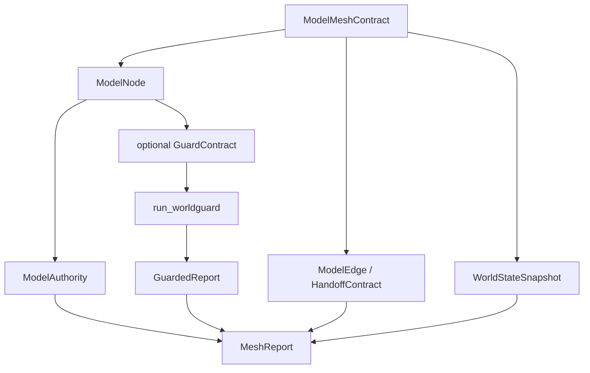

# WorldGuard ModelMesh Core FlowGuard Review

Route: `existing_model_preflight` + `model_mesh_maintenance` + `development_process_flow`

## Existing Model Preflight

- Model search paths: `WorldGuard_TECHNICAL_SPEC.md`, `skills/worldguard/SKILL.md`, `skills/worldguard/references/*.md`, `.flowguard/worldguard_mvp_structure.md`, `.flowguard/worldguard_field_lifecycle.md`, `openspec/changes/productize-worldguard-mvp`, `openspec/changes/add-worldguard-model-mesh-core`.
- Current owner evidence: `worldguard.contracts` owns unit contracts; `worldguard.kernel` owns single-contract Guard dispatch; `worldguard.reports` owns child result aggregation; `skills/worldguard` owns Codex usage instructions.
- Reuse decision: `extend_existing`. Add a mesh layer above `GuardContract`; do not replace unit contract semantics.
- Duplicate boundary risk: fiction/novel/paragraph/quest adapters must remain outside WorldGuard core. Core fields must stay domain-neutral.
- Old-shape evidence: prior `.flowguard/worldguard_mvp_structure.md` predates executable ModelMesh and is scoped to MVP unit checks only.

## FunctionBlock Ownership

| FunctionBlock | Target module/artifact | Owns |
|---|---|---|
| Mesh contract normalization | `worldguard.mesh` | `ModelMeshContract`, `ModelNode`, `ModelEdge`, `WorldStateSnapshot` loading and serialization |
| Model authority boundary | `worldguard.mesh` | `ModelAuthority`, authority overreach findings, scope limits |
| Mesh handoff validation | `worldguard.mesh` | read-only edge checks, allowed/forbidden use, stale source checks |
| Mesh closure aggregation | `worldguard.mesh` | child Guard report preservation, mesh findings, aggregate status |
| Unit Guard execution | `worldguard.kernel` | unchanged `GuardContract` dispatch and child `GuardedReport` generation |
| CLI mesh surface | `worldguard.cli` | `mesh-check --mesh` JSON command |
| Codex skill integration | `skills/worldguard/SKILL.md` and installed copy | unit-check vs mesh-check workflow selection |

## ModelMesh Snapshot

## Closure Hazards

| Hazard | Required disposition |
|---|---|
| Child-local `PASS` used as whole-mesh `PASS` | MeshReport must aggregate child reports plus mesh findings |
| Downstream fills upstream `GAP` | Read-only handoff and child ledger preservation |
| Model uses output outside authority | `BOUNDARY_EXCEEDED` mesh finding |
| Edge consumes output outside declared `allowed_use` | `BOUNDARY_EXCEEDED` handoff finding |
| Stale source model supports current target | `GAP` stale-source finding when current evidence is required |
| Forbidden output consumed downstream | `FAIL` handoff finding |
| Dependency cycle | `FAIL` cycle finding |
| Domain adapter fields leak into core | skill/docs review and tests use only domain-neutral fields |

## Development Process Freshness

- Stage order: OpenSpec -> FlowGuard notes -> skill/reference contracts -> runtime -> CLI/examples/tests -> installed skill sync -> validation -> Git sync.
- Later writes that stale evidence: any edit to `worldguard.mesh`, `worldguard.cli`, `skills/worldguard`, reference docs, tests, or installed skill copy requires rerunning relevant tests and helper commands.
- Minimum revalidation:
  - `openspec validate add-worldguard-model-mesh-core --strict`
  - `python -m pytest`
  - `python -m worldguard.cli mesh-check --mesh examples/model_mesh/basic_mesh.yaml`
  - `python C:\Users\liu_y\.codex\skills\worldguard\scripts\run_worldguard_check.py --example fuel_cell`
  - repository/installed skill hash comparison

## Final Validation Snapshot

- `python -m pytest -q`: 24 passed.
- `openspec validate add-worldguard-model-mesh-core --strict`: valid.
- `python -m worldguard.examples.fuel_cell --check`: `ok=true`; legacy toy reports remain `PASS,PASS,FAIL`.
- `python -m worldguard.cli mesh-check --mesh examples\model_mesh\basic_mesh.yaml`: mesh report status `PASS` with no findings.
- Installed skill helper:
  - `--example fuel_cell`: `ok=true`.
  - `--mesh examples\model_mesh\basic_mesh.yaml`: mesh report status `PASS` with no findings.
- Installed skill sync: repository and installed copies match for `SKILL.md`, helper script, and all WorldGuard reference files touched by this change.

## Claim Boundary

This FlowGuard record supports a generic ModelMesh core change only. It does not support fiction adapter, novel writing workflow, game quest workflow, academic chapter workflow, or complete formal-solver claims.
