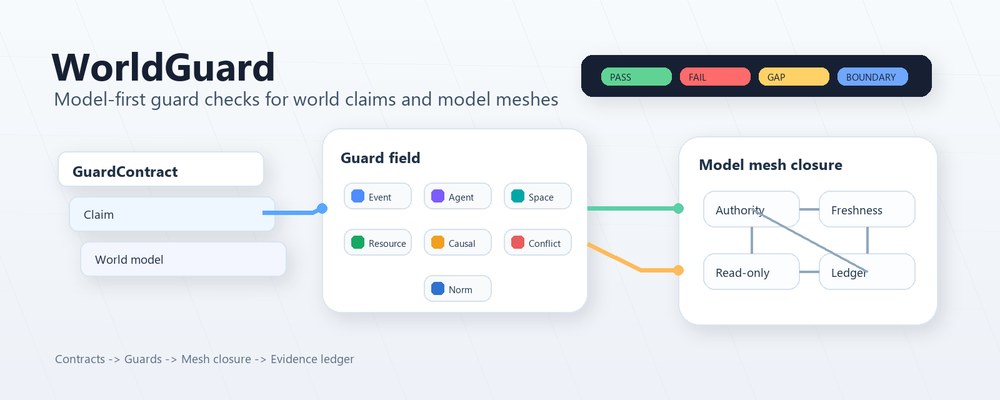

# WorldGuard

<!-- README HERO START -->
<p align="center">
  
</p>

<p align="center">
  <strong>A model-first guard framework for auditable world-claim checks.</strong>
</p>
<!-- README HERO END -->

**Current release:** `v0.1.0`<br>
**Package:** `worldguard`<br>
**Release type:** source-only Python package and Codex skill workflow

WorldGuard checks whether a claim about a modeled world is supported, contradicted, missing required inputs, or outside the declared model boundary. It is built for workflows where an AI assistant, developer, or reviewer needs structured evidence instead of a narrative-only answer.

English comes first; a Chinese mirror follows below.

## What It Does

WorldGuard provides two core check shapes:

- `GuardContract`: checks one claim against one explicit world model.
- `ModelMeshContract`: checks multiple model nodes, authority boundaries, read-only handoffs, source freshness, dependency cycles, and child ledger preservation.

The runtime returns four statuses without collapsing them:

- `PASS`: the declared model supports the requested claim.
- `FAIL`: the declared model contradicts the claim.
- `GAP`: required model inputs are missing.
- `BOUNDARY_EXCEEDED`: the claim asks the model to support semantics it does not own.

## Guard Families

WorldGuard currently includes these guard families:

- `EventGuard`: event and trace support.
- `AgentGuard`: agent beliefs, capabilities, desires, and intentions.
- `SpaceGuard`: spatial relation checks.
- `ResourceGuard`: resource, place, token, transition, and capacity checks.
- `CausalGuard`: structural causal support.
- `ConflictGuard`: conflicting incentives or payoff-policy contradictions.
- `NormGuard`: permission, obligation, and prohibition checks.

## ModelMesh

`ModelMeshContract` is the generic connection layer above unit guard checks. It is designed to prevent a locally valid model from being used as proof for a larger system when the connection is not justified.

It checks:

- model authority: each node can only support the semantics it owns;
- handoffs: downstream nodes may read upstream evidence but cannot mutate it;
- `allowed_use` and `forbidden_use`: outputs must stay inside declared use boundaries;
- freshness: stale or unknown sources cannot support current downstream claims when current evidence is required;
- cycles: dependency loops are reported as mesh failures;
- evidence preservation: child reports, ledgers, gaps, and counterexamples survive aggregation.

## Quick Start

```powershell
python -m pip install -e .
python -m pytest
python -m worldguard.examples.fuel_cell --check
python -m worldguard.cli check --example fuel_cell
python -m worldguard.cli mesh-check --mesh examples/model_mesh/basic_mesh.yaml
```

If your Python scripts directory is on `PATH`, the console entry point is also available:

```powershell
worldguard check --example fuel_cell
```

## Python API

```python
from worldguard import GuardContract, ModelMeshContract, run_worldguard, run_model_mesh

contract = GuardContract.from_dict({...})
report = run_worldguard(contract)

mesh = ModelMeshContract.from_dict({...})
mesh_report = run_model_mesh(mesh)
```

## Codex Skill

The repository includes a Codex skill copy under `skills/worldguard/`. It describes how to build `GuardContract` and `ModelMeshContract` inputs, run the helper script, and report non-pass evidence without converting it into a weak pass.

For a local Codex installation, place the skill under:

```text
$CODEX_HOME/skills/worldguard
```

## What This Is Not

WorldGuard is not a physics solver, legal authority, safety certifier, market model, or deployment-readiness checker. The fuel-cell example is a toy fixture for guard behavior and regression testing. It does not validate real fuel-cell physics, legal compliance, safety certification, deployment readiness, market truth, or business strategy.

WorldGuard also does not include a domain-specific novel, academic-paper, or game-design workflow in this core package. Those should be built as upper-layer skills that call the generic WorldGuard contracts.

## Repository Layout

```text
worldguard/                  Python runtime and CLI
worldguard/guards/           Guard implementations
examples/fuel_cell/          Toy unit-check fixture
examples/model_mesh/         Generic mesh-check fixture
tests/                       Runtime and regression tests
skills/worldguard/           Codex skill copy
openspec/                    Change proposals and specs
docs/                        Architecture and adoption notes
assets/readme-hero/          README visual assets
```

## Release Notes

See [CHANGELOG.md](./CHANGELOG.md). The first source-only release is `v0.1.0`.

## License

No license file is included yet. Treat this repository as source-visible but not yet licensed for unrestricted third-party reuse until a license is added.

---

# WorldGuard 中文说明

**当前版本：** `v0.1.0`<br>
**包名：** `worldguard`<br>
**发布类型：** 源码版 Python 包 + Codex 技能工作流

WorldGuard 用来检查一个“世界声明”是否被显式模型支持、是否被模型反驳、是否缺少必要输入，或者是否超出了模型边界。它的目标不是给一个凭感觉的自然语言结论，而是保留结构化证据、缺口、反例和边界。

## 它能做什么

WorldGuard 有两种核心检查形态：

- `GuardContract`：一个声明，对一个显式世界模型做单元检查。
- `ModelMeshContract`：多个模型节点之间的连接检查，包括权限边界、只读 handoff、证据新鲜度、依赖循环和子报告保留。

运行结果不会被压成模糊的“通过/不通过”，而是保留四种状态：

- `PASS`：模型支持这个声明。
- `FAIL`：模型反驳这个声明。
- `GAP`：缺少必要输入。
- `BOUNDARY_EXCEEDED`：声明要求模型支持它没有权限支持的语义。

## Guard 类型

当前包含：

- `EventGuard`：事件和轨迹。
- `AgentGuard`：主体的信念、能力、愿望和意图。
- `SpaceGuard`：空间关系。
- `ResourceGuard`：资源、place、token、transition 和 capacity。
- `CausalGuard`：结构因果支持。
- `ConflictGuard`：激励冲突或收益策略矛盾。
- `NormGuard`：许可、义务和禁止。

## ModelMesh

`ModelMeshContract` 是单个 Guard 检查之上的通用连接层。它解决的问题是：一个局部模型通过了，不等于整个模型网格可以通过。

它会检查：

- 模型权限：每个节点只能支持自己拥有的语义；
- handoff：下游只能读上游证据，不能修改上游结果；
- `allowed_use` 和 `forbidden_use`：输出用途必须留在声明边界内；
- freshness：需要当前证据时，陈旧或未知来源不能支撑下游当前声明；
- 循环依赖：依赖环会导致 mesh 失败；
- 证据保留：子报告、ledger、gap 和反例不能在聚合时丢失。

## 快速开始

```powershell
python -m pip install -e .
python -m pytest
python -m worldguard.examples.fuel_cell --check
python -m worldguard.cli check --example fuel_cell
python -m worldguard.cli mesh-check --mesh examples/model_mesh/basic_mesh.yaml
```

## 这个项目不是什么

WorldGuard 不是物理求解器、法律判断器、安全认证器、市场模型或部署可行性判断器。fuel-cell 示例只是测试用的 toy fixture，不证明真实燃料电池物理、法律合规、安全认证、部署准备、市场真实性或商业策略。

这个核心包也不直接包含小说写作、学术论文修改或游戏设计工作流。那些应该作为上层技能来使用 WorldGuard 的通用 contract。
