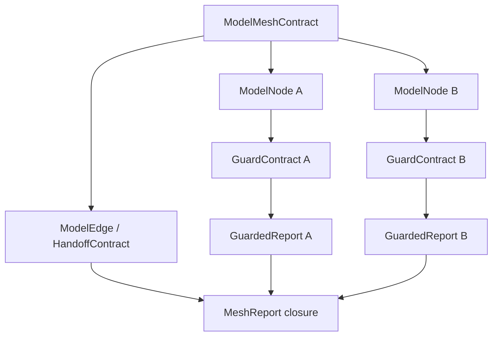
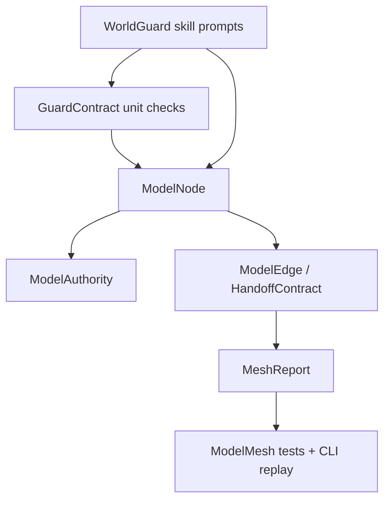

## Context

The completed `productize-worldguard-mvp` change created a runnable MVP with `GuardContract`, seven Guard runners, ledgers, Kernel aggregation, CLI checks, tests, and a local Codex skill. The next gap is not another domain-specific adapter; it is a generic core layer for checking how multiple world models connect.

## Goals / Non-Goals

**Goals:**
- Add a ModelMesh layer that is generic across fiction, games, policy, simulation, organization workflows, and other upper-layer adapters.
- Preserve the existing single-contract behavior and public `run_worldguard(contract)` API.
- Make mesh closure explicit: local child `PASS` is not whole-mesh proof when authority, freshness, dependencies, or handoffs are weak.
- Add authoring guidance to the WorldGuard skill without adding domain-specific fields to the core.

**Non-Goals:**
- Do not implement fiction, chapter, scene, paragraph, quest, or other domain adapter semantics.
- Do not replace the seven Guard runners or their existing `run(contract)` interface.
- Do not claim complete formal solver coverage beyond the MVP checks.

## Decisions

1. Add `worldguard.mesh` instead of expanding `worldguard.contracts`.
   - Rationale: `GuardContract` remains the unit-level contract. Mesh topology is a separate layer and should not make simple checks heavier.

2. Represent mesh topology with explicit node and edge records.
   - Rationale: parent/child, dependency, refinement, replacement, conflict, and downstream consumption are different relationships and should be inspectable.

3. Treat `ModelAuthority` as a first-class boundary.
   - Rationale: a local model can be correct inside its own scope while still being misused by a downstream model.

4. Keep handoffs read-only and failure-preserving.
   - Rationale: downstream nodes may consume upstream evidence, but they may not mutate upstream status, fill missing slots, or delete counterexamples.

5. Use `GuardStatus` for mesh reports.
   - Rationale: mesh closure should preserve the same four status semantics: `PASS`, `FAIL`, `GAP`, and `BOUNDARY_EXCEEDED`.

## Model Shape

## Field Lifecycle Plan

- New behavior-bearing mesh fields: `mesh_id`, `schema_version`, `run_id`, `nodes`, `edges`, `snapshots`.
- New node fields: `model_id`, `model_version`, `model_kind`, `authority`, `freshness_status`, `contract`.
- New authority fields: `owns`, `excludes`, `scope_limits`.
- New edge fields: `edge_id`, `source_model_id`, `target_model_id`, `relation`, `output_refs`, `allowed_use`, `forbidden_use`, `read_only`, `requires_current_source`.
- New report fields: `status`, `node_reports`, `findings`, `aggregate_ledger`, `scope_limits`.
- Existing `GuardContract` fields are preserved. No old field is removed.

## Validation Plan

- Existing tests must continue to pass unchanged.
- New tests must cover:
  - mesh report preserves child Guard ledgers;
  - child `GAP` prevents mesh `PASS`;
  - forbidden downstream use becomes mesh `FAIL`;
  - stale source dependency becomes mesh `GAP`;
  - authority overreach becomes `BOUNDARY_EXCEEDED`;
  - dependency cycles become mesh `FAIL`;
  - CLI `mesh-check` emits JSON.

## FlowGuard Snapshot

The claim boundary is core ModelMesh behavior only. Upper-layer adapters may map their domain terms into ModelMesh inputs, but those terms are not part of this change.
