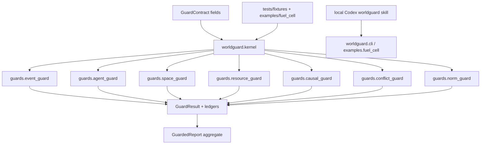

## Context

The current workspace contains `WorldGuard_TECHNICAL_SPEC.md`, productization audits, route-local evidence, and a WG-13 repair checker. It does not contain an installable `worldguard` package, public tests, examples tree, README, pyproject, or local Codex skill. The implementation must preserve existing evidence files and peer-agent work while adding a clean product surface.

## Goals / Non-Goals

**Goals:**
- Create a small but runnable Python MVP with typed contracts, ledgers, seven Guard runners, Kernel aggregation, CLI, examples, and tests.
- Add a local Codex skill named `worldguard` that forces structured contract-first checks and rejects narrative-only PASS claims.
- Keep route-local `.flowpilot/`, `evidence/`, stale v4 checker/evidence, and repair closure files outside the public package and Git commit surface.
- Initialize local install and Git tracking for the productized files.

**Non-Goals:**
- Do not repair FlowPilot final-closure process debt in this change.
- Do not claim real fuel-cell physics, legal compliance, safety certification, deployment readiness, market truth, or strategy proof.
- Do not delete historical route evidence during the productization pass.

## Decisions

1. Use standard-library dataclasses and enums for the MVP.
   - Rationale: the first MVP should run without a dependency resolver blocker.
   - Alternative considered: Pydantic models. Rejected for now because the current workspace has no package metadata or lockfile.

2. Keep every Guard behind a common `run(contract: GuardContract) -> GuardResult` interface.
   - Rationale: this keeps tests, Kernel dispatch, and Codex skill behavior consistent.
   - Alternative considered: per-Guard bespoke APIs. Rejected because they make Kernel orchestration and skill instructions harder to verify.

3. Implement lightweight deterministic checks, not full formal solvers.
   - Rationale: the MVP must prove status semantics, ledger preservation, and boundaries before deeper domain solvers are added.
   - Alternative considered: implementing full EC, BDI, RCC8, CPN, SCM, Markov game, and Deontic solvers immediately. Deferred because it would obscure the packaging and acceptance boundary.

4. Treat fuel-cell material as an optional fixture.
   - Rationale: the productization audit says fuel-cell evidence is sample-only and must not become a hidden core requirement.
   - Alternative considered: keeping root `evidence/` as public data. Rejected because it mixes route evidence with product surface.

5. Install the Codex skill under the local Codex skill directory, such as `$CODEX_HOME/skills/worldguard`.
   - Rationale: this makes the skill discoverable in local Codex sessions.
   - Alternative considered: keep skill docs only inside the repo. Rejected because the user asked to synchronize the local installed version.

## Risks / Trade-offs

- Minimal Guard logic may be mistaken for complete domain reasoning. Mitigation: docs and skill instructions state the MVP checks model structure and semantics only.
- Packaging cleanup could disturb parallel agents. Mitigation: add ignore/package boundaries and copy sample files instead of deleting existing evidence.
- OpenSpec, FlowGuard, package, skill, install, and Git steps can stale each other. Mitigation: run full tests after edits, run editable install, validate the skill, then initialize/commit Git at the end.
- Local Codex skill validation could drift from package behavior. Mitigation: the skill script imports and calls the installed `worldguard` package.

## FlowGuard Structure Snapshot

## Field Lifecycle Plan

- New canonical behavior fields: `contract_id`, `schema_version`, `run_id`, `claim.claim_id`, `claim.text`, `claim.target_guards`, `claim.requested_semantics`, `world_model.*`, `inputs.*`, `dependencies.upstream_results`, `dependencies.read_only`, `output_requirements.*`.
- Replacement disposition: old singular `target_guard` is accepted as an input alias only when loading loose dictionaries; canonical objects expose `target_guards`.
- New result fields: `result_id`, `contract_id`, `guard`, `status`, `supported_claims`, `rejected_claims`, `missing_slots`, `boundary_exceeded`, `errors`, `counterexamples`, `ledgers`, `assumptions_used`, `scope_limits`, `consumed_inputs`.
- New ledger fields: `ledger_entry_id`, `run_id`, `claim_id`, `guard`, `channel`, `status_impact`, `payload`, `source_refs`, `read_only_for_downstream`, `created_at_step`.
- Behavior-bearing fields project to tests through schema validation, per-Guard fixtures, Kernel handoff tests, and fuel-cell replay.

## Migration Plan

1. Add package skeleton and contracts.
2. Add Guard runners and Kernel.
3. Copy fuel-cell v5 fixture files into `examples/fuel_cell/`.
4. Add tests for contracts, ledgers, guards, Kernel, CLI, and example replay.
5. Add README, pyproject, `.gitignore`, and productization notes.
6. Create and validate the local Codex skill.
7. Run tests, install editable package, verify CLI, initialize Git if needed, and commit productized files only.
